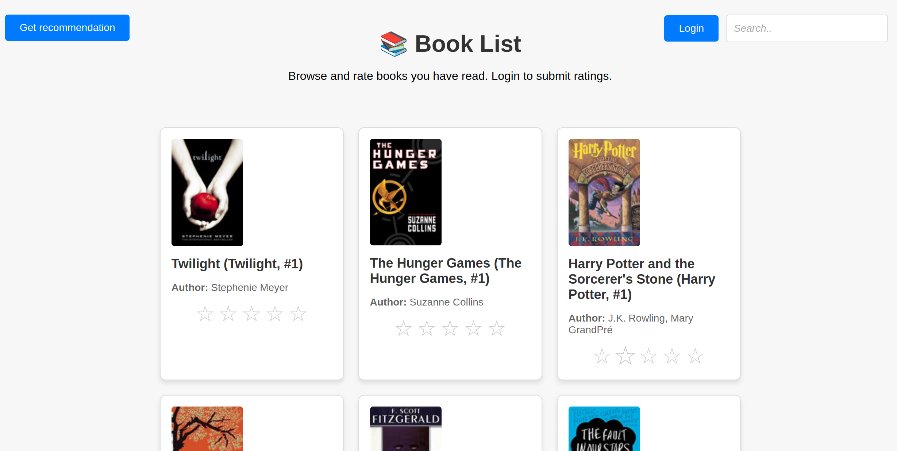
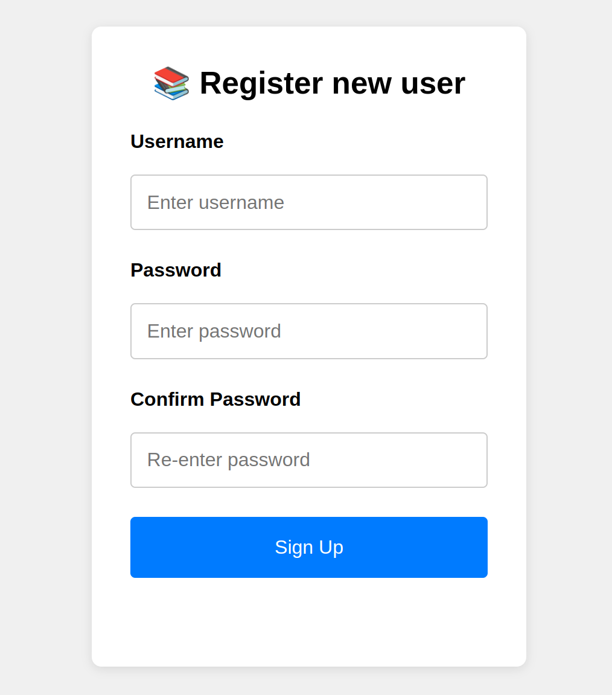
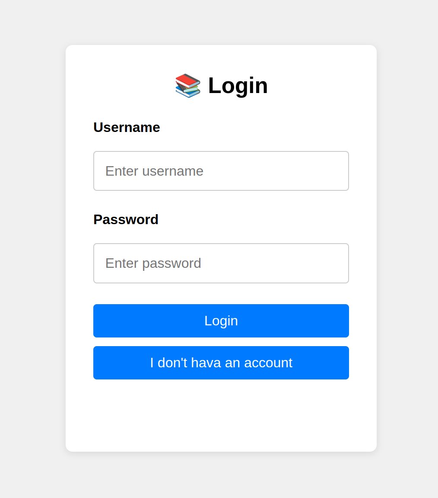
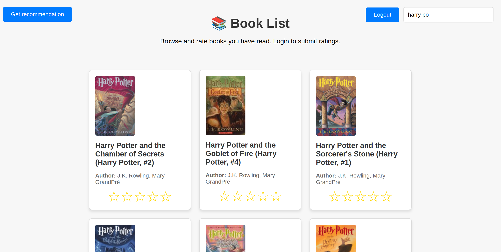
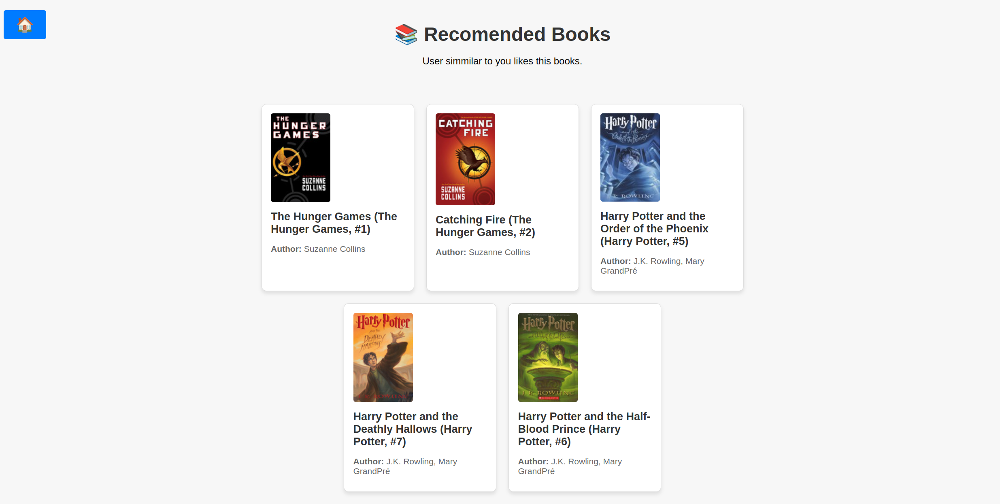
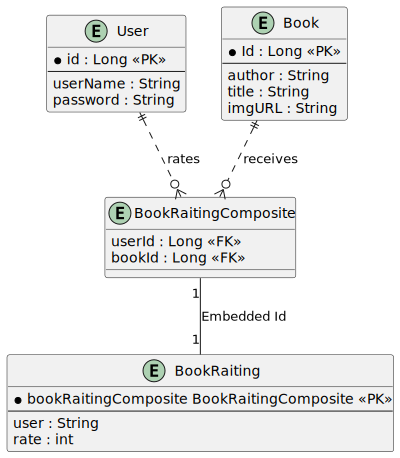

# Book recommendation system 📚

This is a RESTful Java Spring Boot application with a JavaScript frontend that helps you find perfect book for your next read.
Users can register and login to the application. They can rate books from one to five stars. 
There are 300 books available rate, and search bar helps find a specific one. 
Users receive books recommendation based on their positive rates. 
Books, users info (with encrypted password) and there rates are store in postgresql database 🐘.  


## Setup

Compile the project using Maven:

```
mvn clean package
```

> [!NOTE]
> For compilation postgressql is required. <br>
> `$sudo systemctl start postgresql`


Start the Docker container. 
```
docker-compose up --build 
```

> [!NOTE]
> Postgressql needs to be turned off to make port 5432 available.<br>
> `$sudo systemctl stop postgresql`

After that, visit http://localhost:8080/ to access the main page.

## Project photos
- Main page

<div style="text-align: center;">
  
</div>


- Register page

<div style="text-align: center;">
  
</div>

- Login page

<div style="text-align: center;">
  
</div>

- Search bar feature

<div style="text-align: center;">
  
</div>

- Recommendation

<div style="text-align: center;">
  
</div>

## RESTfull endpoints

* [GET] `http://localhost:8080/books` return the list of all books from database. 
```
  [
  {
  "author": "Suzanne Collins",
  "title": "The Hunger Games (The Hunger Games, #1)",
  "imgURL": "https://images.gr-assets.com/books/1447303603m/2767052.jpg",
  "id": 1
  },
   ...
  ]
```
*  [POST] `http://localhost:8080/api/register` allows to add new user to database. 
```
{
    "username": "User2",
    "password": "User2",
    "repeatedPassword": "User2"
}
```

*  [POST] `http://localhost:8080/api/login` allows for the authentication. In response you get JWT token. 
```
{
    "username": "User",
    "password": "User"
}
```


*  [POST] `http://localhost:8080/books/{bookId}` allows authenticated user to rate the concrete book.
```
Headers
raiting: 1
Authorization: Bearer ey....
```

*  [GET] `http://localhost:8080/books/{bookId}/rate` allows authenticated user to get the rate the concrete book.
```
Headers
Authorization: Bearer ey....
``` 
* [GET] `http://localhost:8080/books/search?regex=REGEX` get the concrete books that mach patter REGEX.
```
Headers
regex: REGEX
```
*  [GET] `http://localhost:8080/api/recommendation` allows authenticated user to get recommended books.
```
Headers
Authorization: Bearer ey....
```

## HTML website by Thymeleaf 
* `http://localhost:8080/`
* `http://localhost:8080/login`
* `http://localhost:8080/register`
* `http://localhost:8080/recommendation`

## Database
This project use [PostgreSQL](https://www.postgresql.org/) database for storing User, Book, BookRaiting and BookRaitingComposite entity. Attribute password is encrypted.

Database raltional diagram:



## Recommendation model
The dataset used for this recommendation system is the [Goodbooks-10k](https://github.com/zygmuntz/goodbooks-10k) dataset, which contains information about books and user ratings.
This recommendation system uses cosine similarity to recommend books based on the ratings provided by users.
Cosine similarity measures how similar the books are to each other. The model finds the most similar books to those that user already read and like. 


## Troubleshooting

If you encounter the following error while trying to start the PostgreSQL service in Docker:
```
ERROR: for postgres  Cannot start service postgres: driver failed programming external connectivity on endpoint postgres_db failed to bind host port for 0.0.0.0:5432:172.19.0.2:5432/tcp: address already in use
```
This error occurs because port `5432` is already in use by another instance of PostgreSQL running on your local machine.

### Solution:
To resolve this, you need to stop the local PostgreSQL server that's occupying port `5432`. You can do this by turning off PostgreSQL on your local computer:
```bash
sudo systemctl stop postgresql
```

## License

This project is licensed under the MIT License - see the [LICENSE](./LICENSE) file for details.


